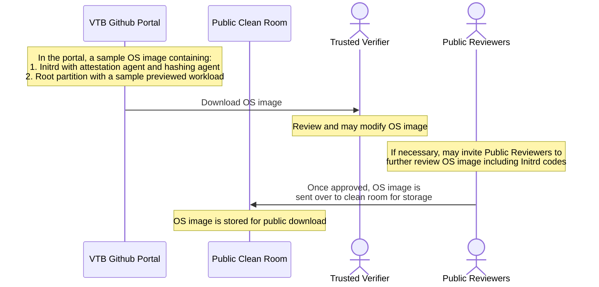
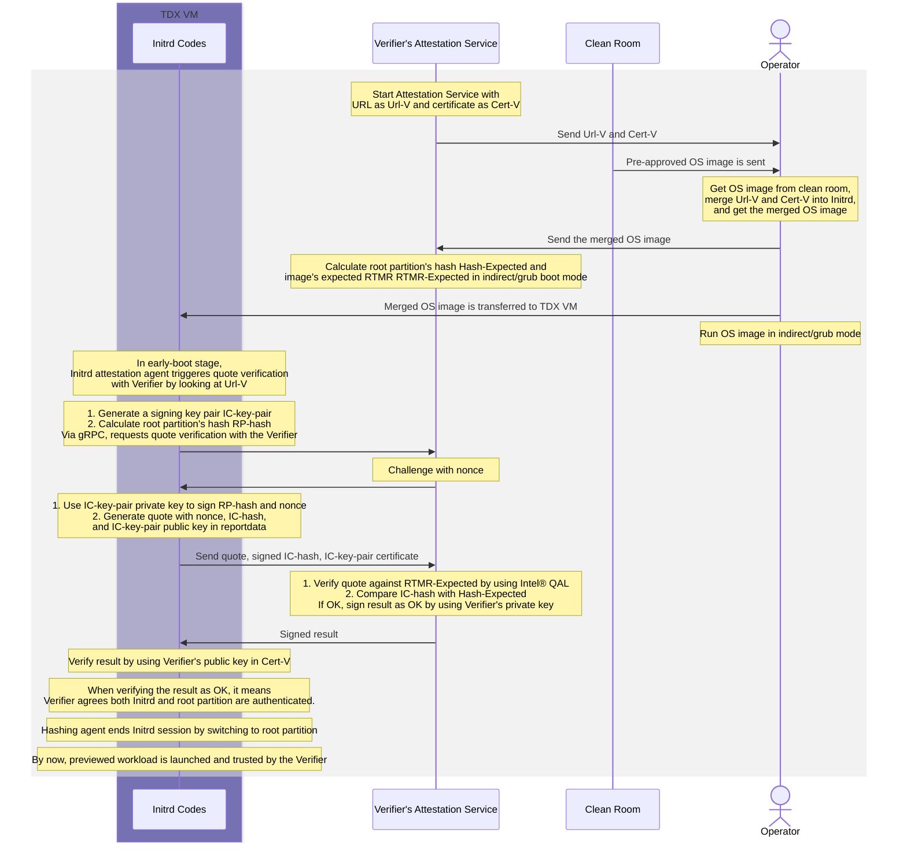

# VM Trusted Bootup
To achieve verifiable transparency, VTB (VM Trusted Bootup) enables a pre-reviewed, open-source workload to be launched inside a TDVM after a trusted verifier has confirmed the authenticity and integrity of a customized workflow pre-loaded in Initrd/Initramfs. It is worth noting that VTB leverages TDX and RTMR measurements to accomplish this goal.

## Overview

This method primarily draws from the design concepts outlined in Section 14.4.2 of [Intel&reg; TDX Virtual Firmware Design Guide](https://www.intel.com/content/www/us/en/content-details/733585/intel-tdx-virtual-firmware-design-guide.html). Rather than launching an encrypted OS image, this method demonstrates how an open-source OS image is launched within a TDVM, where its authenticity is verified by a trusted verifier to ensure a verifiable launch process. 

### Key Features

- TDX for security
- RTMR generation and measurement
- Intel&reg; Appraisal Engine
- Build Initrd codes and generate expected RTMR values
- Attestation service for verification
- Hashing mechanisms

## Architechture

## System Flow
### Open-sourced OS image Preparation

### VM Trusted Bootup via Trusted Initrd Codes

## Prerequisites

- Intel CPU with SGX and TDX support
- DCAP driver and related software stack
- Linux environment (this project has worked successfully with Ubuntu 22.04 LTS)

## Preamble
1. You need at least one host to operate with:
    Host A: meets the [prerequisites](#prerequisites)

## Usage

## Current Phase
- [x] Basic build up of Initrd codes inclusing attestation agent, gRPC, and hashing agent
- [x] Basic quote verification via gRPC
  
## Future Work
- [ ] Finish the codes for Verifier's attestation service
- [ ] Finish the whole VTB process

### Security Enhancements
- [ ] Validate RTMR value changes when Initrd codes are changed
- [ ] Evaluate whether the hashing agent can ensure data partition disk is correctly hashed and intact during bootup
  
### Architectural Improvements
- [ ] Use TDVF CFV to configure and preload Verifier's URL and Certificate
- [ ] Use RA-TLS for quote verification

## Design Considerations for Future Versions

### Current Limitations