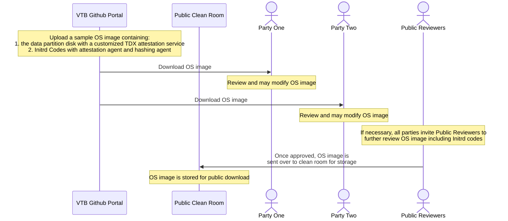
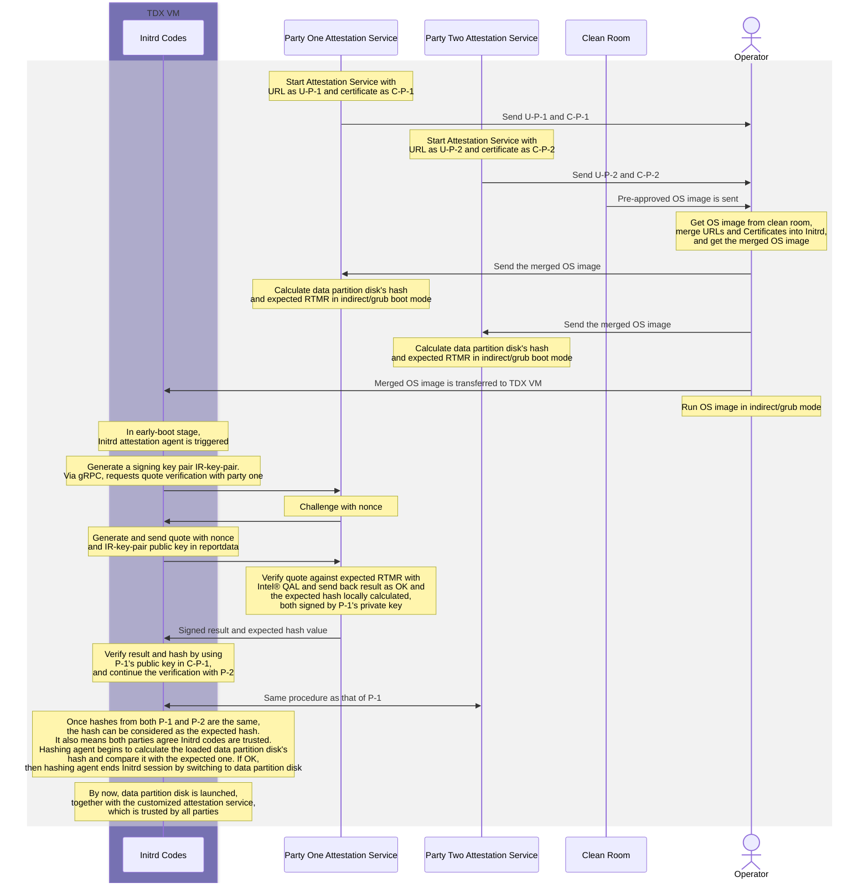

# VM Trusted Bootup
For multi-party collaboration scenarios, VTB (VM Trusted Bootup) allows a previewed open-sourced workload to be launched inside TDVM after all parties agree upon the trustiness of a customized work flow pre-loaded in Initrd/Initramfs. It is worth noting that VTB relies on TDX and RTMR check mechanism to achieve this goal.

## Overview

There is an existing project: [Full Disk Encryption](https://github.com/cc-api/full-disk-encryption/blob/main), which implemented a method to first decrypt and then load an encrypted disk image in a TDVM. VTB revises the procedure by allowing a previewed open-sourced workload to be trusted and bootup in a TDVM. The reason why unencrypted OS images are needed is because for multi-party scenarios, encrypted OS images are black boxes that no other parties than the image owners can sit assured that they are trusted. Our method mainly refers to the design idea in chapter 14.4.2 in [Intel&reg; TDX Virtual Firmware Design Guide](https://www.intel.com/content/www/us/en/content-details/733585/intel-tdx-virtual-firmware-design-guide.html). It showcases how an open-sourced OS image is launched in a TDVM, which is trusted by all parties. 

### Key Features

- TDX for security
- RTMR generation and measurement
- Intel&reg; Appraisal Engine
- Build Initrd codes and generate expected RTMR values
- Attestation service for verification
- Hashing mechanisms

## Architechture

## System Flow
### Open-sourced OS image Preparation

### VM Trusted Bootup via Trusted Initrd Codes

## Prerequisites

- Intel CPU with SGX and TDX support
- DCAP driver and related software stack
- Linux environment (this project has worked successfully with Ubuntu 22.04 LTS)

## Preamble
1. You need at least one host to operate with:
    Host A: meets the [prerequisites](#prerequisites)

## Usage

## Current Phase
- [x] Basic build up of Initrd codes inclusing attestation agent, gRPC, and hashing agent
- [x] Basic quote verification via gRPC
  
## Future Work
- [x] Finish the codes for each party's attestation service
- [x] Finish the whole VTB process

### Security Enhancements
- [x] Validate RTMR value changes when Initrd codes are changed
- [x] Evaluate whether the hashing agent can ensure data partition disk is correctly hashed and intact during bootup
  
### Architectural Improvements
- [x] Use TDVF CFV to configure and preload all parties' URLs and Certificates
- [x] Use RA-TLS for quote verification

## Design Considerations for Future Versions

### Current Limitations